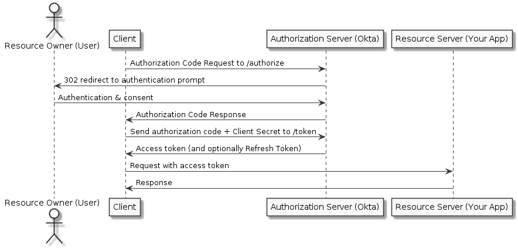

# Identity Access Management
In deze blog geven we informatie over aspecten rondom authenticatie en authorisatie binnen moderne applicaties.

Om gebruik te maken van een applicatie is het vaak noodzakelijk dat gebruikers geauthenticeerd en geauthoriseerd worden. Voorheen werd dit in veel applicaties gerealiseerd door in de database een lijst met gebruikers en de bijbehorende credentials bij te houden. Regelmatig zijn dit soort applicaties vatbaar voor aanvallen, waardoor er gebruikersinformatie wordt buitgemaakt. Uiteraard moet de applicatie zo veilig mogelijk worden opgezet, maar beter is het om het beheer van de identiteiten uit te besteden. De applicaties zijn dan afhankelijk van een externe service voor het authenticeren en eventueel authoriseren van gebruikers. De gebruikerinformatie staat dan (alleen) in de externe service. 

Er zijn legio services die gebruikt kunnen worden voor het beheer van de identiteiten. Uiteraard kan het identity management systeem zelf ontwikkeld worden. Hier zijn ook standaard packages voor beschikbaar zoals Identity Server. Daarnaast zijn er verschillende SAAS-oplossingen die gebruikt kunnen worden, zoals Auth0, Okta, Azure AD (B2C). 

Om te zorgen dat de te ontwikkelen applicatie goed kan communiceren met het identity management systeem, wordt er gebruik gemaakt van authenticatie protocollen. Okta biedt bijvoorbeeld een eigen authenticatie API aan. Daarnaast worden door Okta ook standaard protocollen zoals OAuth, OpenID en SAML aangeboden. We kijken in dit artikel verder naar deze standaard protocollen, omdat dit ook in veel andere identity management systemen is toe te passen.

Het voordeel van het gebruik van een extern identity management systeem is dat er veelal gebruik gemaakt wordt van een partij die zich focust op het veilig maken van authenticatie/authorisatie. Een ander voordeel is dat er mogelijk Single Sign-On geboden wordt.

## OAuth 2.0
OAuth zorgt ervoor dat applicaties geauthoriseerd kunnen worden om afschermde content te benaderen. Dit protocol is ontstaan uit de tijd dat (web)applicaties toegang vroegen aan gebruikers om bijvoorbeeld de contacten uit hun mailbox uit te lezen. Dit werd dan gerealiseerd door gebruikers hun gebruikersnaam en wachtwoord in te laten voeren. De applicatie kon door middel van deze credentials toegang krijgen tot de benodigde informatie. Het grote nadeel hieraan is uiteraard dat de applicatie ongelimiteerde toegang kreeg, en dat de gebruiker alleen toegang kon ontzeggen door het wachtwoord van het account te wijzigen. 

### Flows
OAuth voorziet in dit probleem door gebruik te maken van flows waarbij de applicatie die toegang wil tot gegevens een token opvraagt bij de authorizatie server.

Er zijn verschillende flows de gebruikt kunnen worden binnen de OAuth standaard. Welke flow gebruikt wordt, hangt af van het soort applicatie toegang wil verkrijgen:
1. **Authorization Code** *voor server-side applicaties, waarbij de source code niet ingezien kan worden*
2. **Authorization Code** met Proof Key for Code Exchange *voor mobiele en native applicaties*
3. **Implicit** *voor single-page applicaties*
4. **Resource Owner** *voor client applicaties waarbij (toch) in de applicatie de credentials van de eindgebruiker bekend zijn*
5. **Client credential** *voor applicaties waarbij geen eindgebruiker betrokken is (machine-to-machine communicatie)*

De code flow ziet er als volgt uit:

### Terminologie
Qua terminologie worden de volgende termen gebruikt: 
- **Client** *de applicatie die toegang wil hebben tot de gegevens*
- **Resource Owner** *de eindgebruiker die eigenaar is van de data (bijv profielinformatie)*
- **Authorization Server** *het identity management systeem waar de gebruikersinformatie geregistreerd staat*
- **Resource Server** *de api die de afgeschermde gegevens kan aanleveren*
De andere flows wijken op sommige punten af van de code flow, maar bij elke flow komt er uiteindelijk een access token bij de client.

Wat belangrijk is binnen OAuth is dat een client app in de basis geen toegang heeft. De clientapp krijgt pas toegang nadat er een request naar de authorization server is gegaan, waarbij de eindgebruiker goedkeuring (consent) heeft gegeven voor toegang tot de gegevens. Om deze goedkeuring te kunnen geven moet de eindgebruiker ingelogt zijn in de authorization server. Nadat de goedkeuring gegeven is, krijgt de client app een authorization code, waarmee een access token opgehaald kan worden. Dit access token kan gebruikt worden om de resource server (API) te benaderen. In de API wordt het token gevalideerd, hetzij door de signing keys te controleren, hetzij door een introspection endpoint van de authorization server aan te roepen. 

### Consent
De gebruiker krijgt bij het geven van de goedkeuring te zien aan welke applicatie toegang wordt gegeven (bijvoorbeeld tot zijn profiel). De applicatie kan zichzelf bij de authorization code flow authenticeren door middel van een client ID en client secret, zodat de gebruiker zeker weet dat een andere applicatie geen toegang heeft. Hiernaast ziet de gebruiker ook welke rechten gegeven wordt aan de applicatie: bijvoorbeeld inzien van NAW-gegevens, of het updaten van profielinformatie. Dit wordt bewerkstelligt door middel van scopes: de client app vraagt bij het verzoek om één of meerdere scopes. Als de gebruiker goedkeuring heeft gegeven, worden de scopes in het access token meegegeven. De resource server kan deze scopes controleren, en eventueel een melding geven als de applicatie iets benadert wat niet geldig is voor de scopes die in het access token zitten.

### Access token
Naast scopes kunnen ook claims meegeven worden aan het access token. Voorbeelden van claims zijn een e-mailadres, de leeftijd of de groep gebruikers waartoe de eindgebruiker behoort. Deze claims kunnen uitgelezen worden door de client en de resource server. Het accesstoken is vaak in het formaat van een JSON Web Token (zie [JWT.IO](https://jwt.io)). In dit token staan de genoemde gegevens samen met de levensduur van het token en een signing voor controle op validiteit. 

Het accesstoken wordt meestal als header aan het request naar de resource server meegegeven:
`Authorization: Bearer <encoded access token>`

### OAuth standaard
OAuth is een standaard waarbij diverse onderdelen gespecificeerd zijn. Er is echter ook veel mogelijkheid tot interpratie van de standaard. Diverse grote spelers in de markt hebben een invulling gegeven aan deze ruimte voor interpretatie, en meestal worden hun implementatievoorbeelden gevolgd.

### Beveiliging
Bij het gebruik van OAuth zijn er diverse beveiligingspunten waar op gelet moet worden. Zo is het belangrijk dat de redirect url van de client geregistreerd staat in de authorisatie server, zodat er geen man-in-the-middle-attack gedaan kan worden, waarbij het access token wordt gekaapd. Verder is het ook belangrijk dat state meegegeven wordt bij de requests naar de authorization server omdat hiermee brute force attacks voorkomen kunnen worden: de client accepteert alleen inkomende verzoeken op de callback url als de state valide is.

Naast een access token voorziet OAuth ook in een refresh token. Dit token kan gebruikt worden om een nieuw access token op te vragen, zonder de gebruiker opnieuw hoeft in te loggen. In de authorization server zijn de policies voor de levensduur van de token vastgelegd. Over het algemeen is vanwege beveiliging de levensduur van een access token niet meer dan een uur. Vervolgens kan het refresh token door de client gebruikt worden om een nieuw token te vragen. De levensduur van een reresh token is ook instelbaar.

### Inrichting
Bij het gebruik van OAuth moet er naast de zaken die de standaard levert ook nagedacht worden waar welke authorisatie gegevens staan. Vragen die hierbij spelen zijn onder andere: staan de permissies van de gebruiker in de database van de client of worden deze meegegeven vanuit het identity management systeem? Welke claims en welke scopes worden meegegeven? 

## OpenID
Het woord Auth in OAuth staat voor authorisatie en niet voor authenticatie. Zoals in de onderstaande afbeelding te zien is, is OpenID wel gespecialiseerd in het leveren van een identiteit van de gebruiker.
. 

OpenID is gebaseerd op OAuth, maar levert in plaats van een access token een ID Token. In dit ID token staan vaak door middel van JWT de claims over de gebruiker (zoals naam en e-mailadres). Een voordeel ten op zichte van OAuth voor het aanleveren de identiteit is dat OpenID niet standaard een access token oplevert waarmee de API benadert kan worden. Bij OAuth zou je naast de identiteit ook de sleutel tot het beheer van de gegevens van de gebruiker krijgen.

## SAML
In plaats van OAuth/OpenID kan er ook gekozen worden voor Secure Assertion Markup Language (SAML) als authenticatie/authorizatie protocol. Dit protocol is gebaseerd op de intergratie (SSO) van enterprise applicaties. Hierbij wordt er federation toegepast. Hoewel SAML als een open protocol is ontworpen, is het toepassen van OAuth voor (mobiele) webapplicaties vaak makkelijker. In het onderstaande diagram wordt de flow van SAML weergeven.

Bij SAML worden de volgende termen gebruikt:
- **Identity Provider** *de bron van de gebruikersidentity*
- **Agent** *het identity management systeem*
- **Service Provider** *de service die de data bevat waar de gebruiker toegang tot wil*

Als de gebruiker is ingelogd bij de identity provider, kan de gebruiker toegang krijgen tot andere applicaties die dezelfde identity provider gebruiken zonder opnieuw te hoeven inloggen. 

# Inrichting Identity Access Management
De meeste identity access management systemen hebben de volgende onderdelen:
- Een database met gebruikers met credentials, profielinformatie en groepen
- Een lijst met applicatie registraties van applicaties die toegang kunnen krijgen (eventueel met een client secret)
- Eén of meerdere authorization servers waarin onder andere policies over de scopes, claims en de levensduur van tokens is vastgelegd
- Een API voor het beheren van de instellingen en gebruikers
- Overige functionaliteiten rond beveiliging, zoals multifactor authenticatie, externe identity providers en vertrouwde netwerken
- Beveiligingsrapportage

# Conclusie
Er zijn diverse aspecten rond Identity Access Management aan bod gekomen. Er spelen echter veel meer details en overwegingen bij de implementatie hiervan. Wilt u meer informatie hierover? Neem dan contact met ons op.

*De gebruikte afbeeldingen zijn afkomstig van [developer.okta.com](https://developer.okta.com/documentation/) en [wikipedia](https://en.wikipedia.org/wiki/OAuth)*
